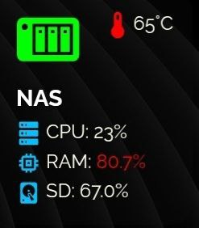
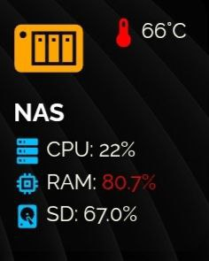
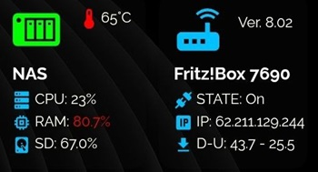
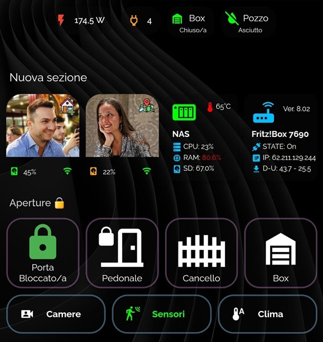

<h2><strong>🖥️ NAS Info</strong></h2>

CARD per mostrare informazioni del nostro NAS

Volevo condividere una scheda che ho creato con l'aiuto delle varie community per visualizzare le informazioni di una persona tramite l'utilizzo dell'app HA companion.

Istruzioni:

da Hacs, installare:
1. button-card

poi ...
1. nel file sensor.yaml, inserire il contenuto di sensor.yaml, se non si dispone del file:
    - è necessario creare sensor.yaml nella cartella config/
    - aprire il file configuration.yaml e inserire questa riga: sensor: !include sensor.yaml
2. in HA create una card manuale e incollate il contenuto del file: card.yaml
3. all'interno del codice della card e del codice inserito nel sensor.yaml, dovete andare a sostituire tutti i sensori del mio NAS con quelli del vostro.

<strong>Alla fine ci troveremo ad avere questo risultato finale:</strong> 

Enjoy!

----------------------------------------

Would you like to give me a hand? The content of this page is completely free of charge and the purpose is certainly not to make money. If you would like to lend me a hand to help with expenses and lost time, you have the following ways:

Make your Amazon purchases from this link:

Join our Telegram channel dedicated to Home Assistant news:

Join our Telegram channel dedicated to home automation products, there are lots of offers:

